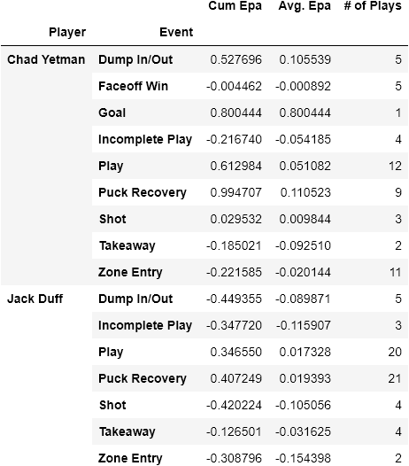
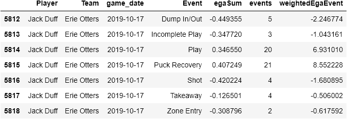

# Analyzing Hockey Player and Team Performance using Expected Goals Added

Aditya Ramani, Amazon

### Introduction
This project is based on the [Big Data Cup competition](https://www.stathletes.com/big-data-cup/). The goal of this project is to create a metric that can be used to objectively analyze player performance, using data for the 2019-2020 season provided by the Erie Otters. This data consisted of the events that occured in the 40 games played by the Otters and their details - X/Y position, Player, Team, Score, etc.   
**Question:** How can we use the Hockey Tracking Dataset to evaluate how well the players perform throught a season?  
**Thesis:** The ultimate goal of a hockey match is to score more goals that your opponent. Getting inspiration from American Football's EPA statistic, I have created models that estimate the number of points added, and the number of shots added by an event.

### Methodology
#### Expected Goals (EG) Model 
The Expected Goals model aims to quantify the value of an event to the next score that may not directly result in a goal. This pulls heavily from Football's Expected Points model. Expected Points are best defined as a combination of probability of all possible next scoring opportunities given the current situation [Yurko et al. Section 3](https://arxiv.org/pdf/1802.00998.pdf). With this data set, I created the model to determine the probability of the next score Y being a Goal, No Score, or a Goal for the other team (-Goal) given an Event E.  
*P(Y=Goal|E)*  
*P(Y=No Score|E)*  
*P(Y=-Goal|E)*  
The model itself is a Random Forest Model, which was trained on the following features, considered together to be the context of an Event.  

| Feature      | Description                                                 |
|--------------|-------------------------------------------------------------|
| Event        | Event that took place. The `Goal` event was treated as a `Shot` |
| x            | Normalized x value. X Coordinate / 200 (max x)              |
| y            | Normalized x value. Y Coordinate / 85 (max y)               |
| Period       | Number of the ongoing Period in the game                    |
| posTeamScore | Score of the team possessing the ball                       |
| defTeamScore | Score of the team not possessing the ball                   |
| fiveOnFive   | Whether both teams have five players on the field or not    |

These features were chosen through cross validation testing from a larger group or features, including the Clock, the more granular details for each event, and the non-normalized values of certain variables.  
The importance of each of the features on the final model is shown below.  

I decided that the calibration measured developed in Yurko et al. would be the best way to determine the validty of the model. This is done by comparing bins of each probability P(Y=y|E) to the actual probability of plays in the bin that were predicted correctly, shown below in graph form. The final unseen calibration error of the model was ~ 0.022. I believe that this is a small enough error for this model to be considered valid. Whle it is double the calibration errors mentioned in Yurko et al. for their EPA model, this model uses far less data.  

#### Metrics
**Expected Goals (EG)** - To determine the final metric of EP, we take the probabilities of each next score y given event E and multiply it by the scoring value *y*.  
  
This defines the expected value of the next goal as the result of a given event. The value for EG on events where the team scores is replaced as 1, as they did score a goal on the play.

**Expected Goals Added (EGA)** - This is the Estimated Number of Goals added by a certain event. This is derived from the EG metric - calculated as the difference in Expected Goals of the current event (i) and the previous event (j) with a few stipulations.  
*EGA = EG_i - EG_j*  
If the team owning the previous event is different than the one owning the current event, the previous EG is multiplied by -1. Since EG is based on the perspective of the possessing team, it is fair to extrapolate that the EG for the opposing team is just the negative value of the current EG.  
In addition, the previous EG is set to 0 at the start of each period and game. This is to account for the fact that each period starts a fresh section of the game. The previous EG is also set to 0 after every goal to prevent a huge swing in EGA for every play that occurs after a goal.

**Event Weighted EGA (ewEGA)** - This metric aims to add the context of the number of events to the EGA metric. This is done by weighting the Cumulative EGA for each event by the total number of that event that occured.  
  
Where *t* is the chosed time frame for the scope of the metric (Period, Game, Season, etc.), *e* is a specific event from the set of all events in the scope *Et*, *Nt* is the total number of events that occured in the scope, *ne,t* is the number of times event *e* occured, and *EGAe,i* is the EGA value of the ith occurence of event *e*.
### Results
Using the EG and EGA metrics, it is now possible to determine which players and events may be giving us a better chance of scoring. 
#### Events
  
First looking at the EG metric as it relates to Events, we can see that taking a shot, on average, has the highest Expected Goals value, while a Penalty has the least. This chart excludes the `Goal` Event, since the EG of those will always be 1. This confirms some priors I had regarding this data set, with regards to the volume of shots impacting a game, similar to soccer.  
  
When looking at EGA as it relates to Events, we can see a trend as it related to possession. Here, you can see that the events that relate to possession changes result in the highest EGA. Events that result in your team getting possession of the puck increases the ability of your team to score. Here, we can also see that Dumps are the least efficient event as well, with Incomplete Plays and Penalties coming in second and third respectively. One more thing I noticed here was that while Shots had the highest average EG, they weren't the highest in terms of EGA. Looking into the distribution of EGA across Shots, we can see that the EGA is not weighted one way or another - not all shots are created equal.  
  
#### Player Performance
When looking at it in terms of the players, we can look at their Avg. EGA/game, in addition to their cumulative EGA/game.  
  
Looking at the Avg. EGA/game with only Erie Otters Players, we can see that most of the players end up with an overall average EGA around 0, but their game-to-game EGA differs. If we look at the game on October 17th, 2020 against the Niagara Ice Dogs, we can see that Chad Yetman had one of his best games of the season, while Jack Duff had one of his worst games.  
  
If we take a closer look at the table breakdown of their play, we can see that Duff got penalized severely for 4 missed shots, while Yetman was rewarded for both scoring a goal, and making 9 puck recoveries.  

  

Duff had a bad game on average in terms of EGA. But, you can see that he did also have 21 Puck Recovries resulting in a Cumulative EGA of 0.4. This was overshadowed by the 4 bad shots he took, because while it had a similar Cumulative EGA, it occured in fewer events, so it penalized him more in a normal average. To counteract this, we can use the Event Weighted EGA.   
  
Here, you can see that the results are a lot more spread out from the center on a game-by-game basis. This metric gives us a more holistic look at how well a player is performing, as it incorporates the number of plays at each event, thus decreasing the impact of outlier events. This does mean it drops the impact of scoring goals as well, which can be seen by Chad Yetman's (Goal Scoring Leader) drop from 7th in EGA per Game to 16th in Event Weighted EGA per Game.

  

Now looking at the new table, you can see the true value of the metric. Duff isn't penalized as much for the lower count events as he was with the overall EGA per Game. This shows that he had just an average game (rather than a bad game) with a Avg. Event Weighted EGA of around 0 for the game.  
Finally, we will take a look at a player's shot efficiency through Spot Cumlative EGA, which is a player's cumulative EGA based on the location on the rink.  
  
This heatmap shows Chad Yetman's Spot Cumlative EGA for all of his shots in the 2019-2020 season. You can gather from this that his most efficient scoring opportunities come when he shoots around 29 feet from the goal, while also favoring the right side of the rink. This lines up with his goal scoring totals, as those are the places where he has the highest scoring percentage. With this data, the team can look to get Chad more shots towards the middle-right side of the net, to increase their chances of scoring.  
  
Looking at Noah Sedore's Spot Cumulative EGA for all of his Play attempts, we can see that he tends to make better passes when he is towards the left side of the rink as opposed to the right. With this data, the team could try and create more opporunities for Noah to pass on the left side, or have him practice more at passing on the right.

### Conclusion
Drawing inspiration from American Football's advanced metrics, I was able to develop a model that quantified how impactful an event in hockey was to the team's ability to score. It was then possible to create metrics that quantified a certain player's impact on the team's chance to score during a given timeframe/ This provides personnel evaluators with more contextual data to make impactful decisions based on their player's performance.

## References